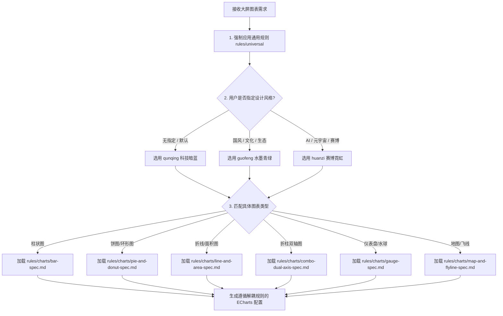

# 大屏数据可视化 Skill (Multi-Style Screen Data Visualization)

## Overview
本 Skill 基于 Edward Tufte 高数据墨水比 (Data-Ink Ratio) 理念与多风格模块化解耦架构打造，用于指导 Agent 构建高质感、高对比度、无缝发光与响应式自适应的大屏 ECharts 5 / 6+ 图表。

核心规则采用 **「通用规则 (Universal Rules)」** 与 **「类型图表特有规则 (Chart-Type-Specific Rules)」** 解耦架构，配合多风格 Token 渲染顶级视觉质感。

---

## 适用场景 (When to Use)

### 适用场景
- 开发或重构数据可视化大屏 (Screen Data Viz)、科技驾驶舱 (Cockpit)、暗色 Dashboards、国风大屏或赛博霓虹大屏的 ECharts (v5 / v6+) 图表。
- 默认 ECharts 样式视觉平淡，需要切换精细风格（「群青」科技暗蓝、「国风」水墨青绿、「幻紫」赛博霓虹）。
- 图表在高分屏或视口缩放时出现拉伸变形、字体错位或边缘锯齿。
- 需要选用符合风格标准的调色盘、等宽字体（D-DIN / DINPro）、纹理贴花生成器（ARIA 斜条纹）与硬朗切口法则。

### 不适用场景 (When NOT to Use)
- 浅色背景 (Light Mode) 的常规 Web 后台管理系统报表。
- 移动端 H5 微型图表或纯文本统计卡片。
- Canvas 2D / WebGL 手写自由绘图或纯 D3.js 图表场景。

---

## 风格与质感路由图 (Decision Flowchart)

---

## 多风格路由系统 (Multi-Style System)

根据用户 Prompt 的场景要求自动匹配或提示用户选择对应视觉风格：

| 风格 Token | 风格名称 | ECharts 主题 JSON | 专属规则文档 | 适用场景 / 行业 |
|---|---|---|---|---|
| `qunqing` | **「群青」科技暗蓝** | `references/themes/qunqing-theme.json` | [`rules/styles/qunqing.md`](rules/styles/qunqing.md) | 科技驾驶舱、IT/数据中心、交通监控、通用暗色大屏 |
| `guofeng` | **「国风」水墨青绿** | `references/themes/guofeng-theme.json` | [`rules/styles/guofeng.md`](rules/styles/guofeng.md) | 生态环境、智慧文旅、数字故宫、农业/乡村振兴、文化展厅 |
| `huanzi` | **「幻紫」赛博霓虹** | `references/themes/huanzi-theme.json` | [`rules/styles/huanzi.md`](rules/styles/huanzi.md) | AI算力中心、元宇宙、赛博朋克、高精尖科技、机器人驾驶舱 |

---

## 解耦规则体系 (Decoupled Rule Architecture)

规则体系重构为两大解耦类别，确保图表既具备统一的高质感基线，又满足特定图表的精细几何约束：

### 一、 通用规则 (Universal Rules - 适用于所有图表)

1. **容器背景透明融入 (`baseline-spec.md`)**：强制 `backgroundColor: 'transparent'`，无缝嵌入大屏玻璃卡片。
2. **轴线降噪与超淡网格 (`baseline-spec.md`)**：关闭 Top/Right 轴线，隐藏 Y 轴线，横向网格 `3%~5%` 超淡虚线，禁用纵向网格。
3. **等宽数字与字阶排版 (`typography-and-numbers.md`)**：关键 KPI 及数值强制使用 `D-DIN` / `DINPro-Medium` 与 `font-feature-settings: "tnum"`。
4. **渐变衰减与斜条纹 (`stripe-texture-and-gradients.md`)**：填充必须配置 `LinearGradient`（顶部发光、底部衰减）；单柱/重点柱图推荐单图层 ARIA 斜条纹贴花（`createAriaStripeDecal`）。
5. **动画与视觉节奏 (`animation-and-rhythm.md`)**：首屏入场 $\le 1.5\text{s}$（`cubicOut` + 基于索引的交错延时 `animationDelay`），数据更新 400~600ms，常态微动 3~6s。
6. **容器动态自适应 (`layout-and-responsive.md`)**：强制开启 `containLabel: true`，绑定 `ResizeObserver` 防抖 resize。

---

### 二、 类型图表特有规则 (Chart-Type-Specific Rules - 精准约束)

1. **柱状图 / 象形柱图 (`rules/charts/bar-spec.md`)**：
   - 硬朗直角 `borderRadius: 0`（上限不得超过 `1`，**严禁 `[4,4,0,0]` 大圆角**）。
   - 5 系列以上密集柱图显式禁用斜条纹；赛博风配置 3D 三角柱（`pictorialBar` 锥形 path）。
2. **饼图 / 环形图 (`rules/charts/pie-and-donut-spec.md`)**：
   - 扇区 `padAngle: 5~8` 物理开裂与 `borderRadius: 1~3` 微倒角（**严禁 $\ge 4$ 大圆角**）。
   - 内外双同心轨迹线露缝穿透 + `GaugeTicks` 60 分段刻度盘 + 中心发光底罩。
   - 坐标中心与标题强制联动设为相同的 `centerX`（如 `'32%'`），彻底防止右偏。
3. **折线图 / 面积图 (`rules/charts/line-and-area-spec.md`)**：
   - `smooth: 0.35` 柔和曲线 + `showSymbol: false` 默认隐藏节点，`areaStyle` 叠加渐变云雾。
4. **折柱混合双轴图 (`rules/charts/combo-dual-axis-spec.md`)**：
   - 单侧网格独占法则：左 Y 轴独占 `splitLine`，右 Y 轴**绝对强制 `splitLine: { show: false }`**。
5. **仪表盘 / 玉珏图 (`rules/charts/gauge-spec.md`)**：
   - 现代无针化进度条（`pointer: { show: false }`） + 居中 D-DIN 大数字。
6. **地图 / 迁徙飞线图 (`rules/charts/map-and-flyline-spec.md`)**：
   - 暗色发光陆块 + 4~6s 低频巡航流光飞线 + 脉冲呼吸散点。

---

## Red Flags - STOP and Start Over

| Agent 辩解 (Rationalization) | 事实与铁律 (Reality) |
|---|---|
| "简单图表用单色 `color: '#12adfd'` 填充更快" | 默认必须配置 `LinearGradient` 渐变，严禁单色平涂大面积色块。 |
| "为了黑白对比更明显，设置 `backgroundColor: '#000'`" | 强制设为 `backgroundColor: 'transparent'`，确保融入大屏玻璃卡片。 |
| "环境中没有 `D-DIN` 字体，直接用默认系统字体" | 关键数字必须配置回退栈 `'D-DIN, DINPro-Medium, monospace'` 并开启 `font-feature-settings: "tnum"`。 |
| "边框使用纯单色描边，或没有设置边框" | 斜条纹柱图必须配置显式渐变边框，且 Alpha 透明度显著高于填充色。 |
| "为了柱体顶部更柔和，设置 `borderRadius: [4, 4, 0, 0]` 大圆角" | 柱状图须保持几何硬朗直角，上限不超过 `1`（推荐 `0`）。 |
| "饼图/环形图扇区没必要加间隔，无缝相连即可" | 扇区必须配置 `padAngle: 5~8` 物理间隔与 `borderRadius: 1~3` 微倒角（严禁 $\ge 4$ 大圆角），并叠加双同心暗轨。 |
| "双 Y 轴图表两边都开启 splitLine 网格线" | 必须强制关闭右 Y 轴网格线（`splitLine: { show: false }`），避免网格交织缠绕。 |

---

## 目录与参考指南 (Directory & References)

- **Skill 核心入口**：`SKILL.md`
- **项目说明**：`README.md`
- **静态参考与工具函数 (`references/`)**：
  - `ariaStripeDecal.ts` —— **[优先推荐]** ECharts 5+ 原生 ARIA 单图层斜条纹贴花生成器
  - `stripePattern.ts` —— 无缝科技斜条纹 Pattern 动态生成工具
  - `themes/` —— 「群青」、「国风」、「幻紫」 ECharts 主题 JSON
- **细则指南 (`rules/`)**：
  - **通用规范 (`rules/universal/`)**：
    - `baseline-spec.md` —— 通用图表基线配置规范 (透明底、轴线降噪、超淡网格、毛玻璃 Tooltip)
    - `typography-and-numbers.md` —— 数字与排版规范 (D-DIN 等宽数字、字阶与状态文字)
    - `stripe-texture-and-gradients.md` —— 斜条纹与渐变质感规范
    - `animation-and-rhythm.md` —— 动画与视觉节奏规范 (1.5s 入场交错与常态微动)
    - `layout-and-responsive.md` —— ResizeObserver 容器自适应范例
    - `anti-patterns.md` —— 踩坑反模式与自动修复指南
  - **类型图表特有规则 (`rules/charts/`)**：
    - `bar-spec.md` —— 柱状图与象形柱图规范 (硬朗直角 borderRadius: 0、象形/3D三角柱)
    - `pie-and-donut-spec.md` —— 饼图/环形图高级感配置规范 (扇区物理开裂、微倒角、内外双同心轨迹线、centerX 联动防偏离)
    - `line-and-area-spec.md` —— 折线图与渐变面积图规范 (smooth 曲线、隐藏节点 showSymbol: false、渐变云雾)
    - `combo-dual-axis-spec.md` —— 折柱混合双轴图规范 (单侧网格独占、右 Y 轴 splitLine: false)
    - `gauge-spec.md` —— 仪表盘与水球图规范 (无针化进度条、GaugeTicks 刻度盘)
    - `map-and-flyline-spec.md` —— 地图与迁徙飞线图规范 (发光陆块、低频巡航飞线)
  - **风格细则 (`rules/styles/`)**：
    - `qunqing.md` / `guofeng.md` / `huanzi.md` —— 三大设计风格专属调色盘与字体规范
- **代码范例 (`examples/`)**：
  - `examples/qunqing/` / `examples/guofeng/` / `examples/huanzi/` —— 对应风格的 TypeScript 代码范例
