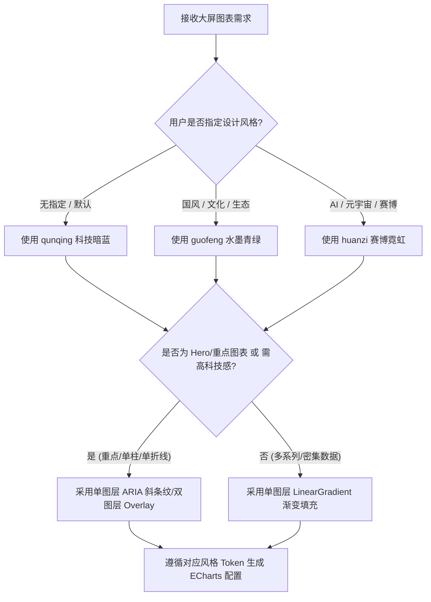

# 大屏数据可视化 Skill (Multi-Style Screen Data Visualization)

## Overview
本 Skill 基于 Edward Tufte 高数据墨水比 (Data-Ink Ratio) 理念与多风格模块化设计架构打造，用于指导 Agent 构建高质感、高对比度、无缝发光与响应式自适应的大屏 ECharts 5 / 6+ 图表。

---

## 适用场景 (When to Use)

### 适用场景
- 开发或重构数据可视化大屏 (Screen Data Viz)、科技驾驶舱 (Cockpit)、暗色 Dashboards、国风大屏或赛博霓虹大屏的 ECharts (v5 / v6+) 图表。
- 默认 ECharts 样式视觉平淡，需要切换精细风格（「群青」科技暗蓝、「国风」水墨青绿、「幻紫」赛博霓虹）。
- 图表在高分屏或视口缩放时出现拉伸变形、字体错位或边缘锯齿。
- 需要选用符合风格标准的调色盘、等宽字体（D-DIN / DINPro）、纹理贴花生成器（ARIA 斜条纹）与硬朗切口法则。

### 不适用场景 (When NOT to Use)
- 浅色背景 (Light Mode) 的常规 Web 后台管理系统报表。
- 移动端 H5 微型图表或纯文本统计卡片。
- Canvas 2D / WebGL 手写自由绘图或纯 D3.js 图表场景。

---

## 风格与质感路由图 (Decision Flowchart)



---

## 多风格路由系统 (Multi-Style System)

根据用户 Prompt 的场景要求自动匹配或提示用户选择对应视觉风格：

| 风格 Token | 风格名称 | ECharts 主题 JSON | 专属规则文档 | 适用场景 / 行业 |
|---|---|---|---|---|
| `qunqing` | **「群青」科技暗蓝** | `references/themes/qunqing-theme.json` | [`rules/styles/qunqing.md`](rules/styles/qunqing.md) | 科技驾驶舱、IT/数据中心、交通监控、通用暗色大屏 |
| `guofeng` | **「国风」水墨青绿** | `references/themes/guofeng-theme.json` | [`rules/styles/guofeng.md`](rules/styles/guofeng.md) | 生态环境、智慧文旅、数字故宫、农业/乡村振兴、文化展厅 |
| `huanzi` | **「幻紫」赛博霓虹** | `references/themes/huanzi-theme.json` | [`rules/styles/huanzi.md`](rules/styles/huanzi.md) | AI算力中心、元宇宙、赛博朋克、高精尖科技、机器人驾驶舱 |

---

## 核心模式对比 (Core Pattern Before / After)

```javascript
// 反模式：平涂纯实色、硬黑背景、强坐标轴杂线
{ backgroundColor: '#000000', series: [{ type: 'bar', itemStyle: { color: '#12adfd' } }] }

// 正确规范：透明融入背景、渐变光晕衰减、高 Alpha 渐变描边、超淡降噪网格
{
  backgroundColor: 'transparent',
  aria: createAriaStripeDecal({ rotation: -45 }), // 不传 color 继承 itemStyle 渐变色，gap 默认 [4, 6]
  yAxis: { splitLine: { lineStyle: { color: 'rgba(255, 255, 255, 0.05)' } } },
  series: [{
    type: 'bar',
    itemStyle: {
      borderWidth: 1.5,
      borderColor: new echarts.graphic.LinearGradient(0, 0, 0, 1, [{ offset: 0, color: 'rgba(18, 173, 253, 1.0)' }, { offset: 1, color: 'rgba(85, 146, 247, 0.6)' }]),
      color: new echarts.graphic.LinearGradient(0, 0, 0, 1, [{ offset: 0, color: 'rgba(18, 173, 253, 0.65)' }, { offset: 1, color: 'rgba(85, 146, 247, 0.15)' }])
    }
  }]
}
```

---

## 核心质感法则 (Universal & Optional Design Specs)

设计大屏图表时区分**通用基线法则**与**可选高级增强方案**：

### 通用基线法则 (Universal Baseline Specs)

1. **容器背景透明融入**：图表容器背景强制设为 `backgroundColor: 'transparent'`，无缝嵌入大屏玻璃卡片 DOM 中。
2. **光晕渐变衰减 (Gradient Layering)**：柱状图与折线面积图默认必须使用 `echarts.graphic.LinearGradient` 渐变填充，顶部/起点高亮发光、底部/终点平滑衰减，严禁单色平涂。
3. **超淡网格与低噪坐标轴 (Low-Noise Grid)**：隐藏顶部与右侧轴线及刻度（`show: false`）；隐藏 Y 轴线，横向网格线透明度控制在 `3% ~ 5%`，禁用纵向网格。
4. **专属调色盘与语义 Token**：严格遵循选定风格（`qunqing`、`guofeng`、`huanzi`）的 6 色语义调色盘与字体规范（详见 [`rules/styles/index.md`](rules/styles/index.md)）。
5. **字阶与等宽数字 (Typography Hierarchy)**：关键数值与 KPI 强制使用等宽数字字体 `D-DIN` / `DINPro-Medium`，配置 `font-feature-settings: "tnum"`。
6. **容器动态自适应 (ResizeObserver)**：配置 `containLabel: true`，绑定 `ResizeObserver` 防抖监听 DOM 容器变化（详见 [`rules/general/layout-and-responsive.md`](rules/general/layout-and-responsive.md)）。
7. **硬朗几何与精细倒角法则 (Global Silhouette Spec)**：
   - **柱状图 (Bar)**：默认使用硬朗直角（`borderRadius: 0`）；若需极微弱边缘软化，上限不得超过 `1`（如 `borderRadius: [1, 1, 0, 0]`）。
   - **饼图/环形图切片 (Pie Sector)**：切片端点仅允许极微弱倒角（`borderRadius: 1 ~ 3`，推荐 `2`），严禁使用大圆角（$\ge 4$）导致端点变成圆滚滚的半圆药丸头。
   - **环形图厚度 (Ring Thickness)**：内外径差值（$\Delta R = R_{outer} - R_{inner}$）控制在 `10% ~ 12%`（如 `['60%', '71%']`），保留轻盈精致感。
   - **容器卡片**：容器微圆角统一控制在 `4px ~ 6px`。
8. **饼图 / 环形图高级感生成原则 (Premium Donut/Pie Chart Specs)**：
   - **离散切片与微倒角 (Pad Angle & Micro Radius)**：扇区切片之间强制配置 `padAngle: 5 ~ 8` 物理断开；端点应用极微倒角（`borderRadius: 1 ~ 3`，推荐 `2`）。
   - **内外双极同心轨迹线 (Exposed Double Track Rings)**：暗轨严禁与主切片半径重合。配置 `['52%', '52.5%']` 内轨与 `['66.5%', '67%']` 外轨将主切片夹在中间，在缝隙中透出双同心线。
   - **统一坐标与中心偏离防护 (Unified CenterX)**：右侧包含 Legend 时，主圆环中心左移至 `center: ['32%', '50%']`；`title.left` 与 `graphic.position` 强制联动设为相同的 `centerX`（如 `'32%'`），防止标题和光晕右偏。
   - **结构化右侧图例 (Precision Legend)**：图例首选右侧纵向排列 (`orient: 'vertical'`)，使用微型正方形 `icon: 'rect'`；利用 `formatter` 实现名称与等宽百分比对齐；显式定义 `legend.data` 仅包含真实业务名称。
   - **工业级刻度盘增强 (Industrial Gauge Ticks)**：内圈刻度加长加粗（`axisTick.length: 8`, `width: 1.5`, `splitNumber: 60`）（详见 [`rules/general/pie-and-donut-spec.md`](rules/general/pie-and-donut-spec.md)）。
9. **动画与交错节奏控制 (Animation & Rhythm Spec)**：
   - **首屏/加载入场动画**：控制在 `1.5s` 内（推荐 `animationDuration: 800ms`，缓动 `cubicOut`），必须配置基于索引的交错延时 `animationDelay: (idx) => idx * 35`，严禁所有柱体齐刷刷无延时弹起或入场过长导致拖沓阻塞。
   - **数据更新动画**：`animationDurationUpdate` 控制在 `400ms ~ 600ms`（推荐 `500ms`），实现敏捷即时响应。
   - **常态低频巡航微动**：入场完成后，仅给 Hero/重点节点与流光线叠加 `3s ~ 6s` 低频微呼吸（如 `effectScatter.period: 4`），避免高频闪烁引起视觉疲劳（详见 [`rules/general/animation-and-rhythm.md`](rules/general/animation-and-rhythm.md)）。

---

### 可选高级增强方案 (Optional High-Texture Enhancements)

1. **斜条纹纹理质感 (Stripe Texture Enhancements)**：
   - **适用场景**：用户明确提示“科技全息”、“斜纹发光”、“赛博朋克”风格，或单柱/单折线重点 Hero 图表。5 系列以上密集柱图避免使用，防止画面杂乱。
   - **硬性搭配法则**：
     1. **显式描边**：使用斜条纹时必须同时配置 `borderWidth: 1 ~ 1.5` 描边。
     2. **渐变边框**：填充为 `LinearGradient` 时，`borderColor` 也必须配置 `LinearGradient`，且边框 Alpha 透明度高于填充色（如 0.8~1.0 vs 0.15~0.65）。
     3. **条纹继承渐变**：渐变填充时 `createAriaStripeDecal` 不传 `color`（保持 `color: undefined`），自动继承渐变色；`gap` 默认 `[4, 6]`。
     4. **严禁纯白条纹**：禁止使用纯白色（如 `rgba(255, 255, 255, 0.85)`）作为斜条纹颜色。单色场景传递与系列同调的颜色，渐变场景自动继承。
   - **实现方案与优先级**：
     - **优先推荐 (Priority 1 - 单图层原生贴花)**：直接使用 ECharts 5+ 原生 `aria: createAriaStripeDecal(...)`（详见 [`references/ariaStripeDecal.ts`](references/ariaStripeDecal.ts)）。
     - **备选方案 (Priority 2 - 双图层 Pattern 重叠)**：底层渐变 + 顶层 `barGap: '-100%'` 遮罩层（详见 [`rules/general/stripe-texture-and-gradients.md`](rules/general/stripe-texture-and-gradients.md) 与 [`references/stripePattern.ts`](references/stripePattern.ts)）。

---

## Red Flags - STOP and Start Over

禁止违反以下原则，发现违规需撤回代码并按规范修复：

| Agent 辩解 (Rationalization) | 事实与铁律 (Reality) |
|---|---|
| "简单图表用单色 `color: '#12adfd'` 填充更快" | 默认必须配置 `LinearGradient` 渐变，严禁单色平涂大面积色块。 |
| "为了黑白对比更明显，设置 `backgroundColor: '#000'`" | 强制设为 `backgroundColor: 'transparent'`，确保融入大屏玻璃卡片。 |
| "环境中没有 `D-DIN` 字体，直接用默认系统字体" | 关键数字必须配置回退栈 `'D-DIN, DINPro-Medium, monospace'` 并开启 `font-feature-settings: "tnum"`。 |
| "边框使用纯单色描边，或没有设置边框" | 斜条纹柱图必须配置显式渐变边框，且 Alpha 透明度显著高于填充色。 |
| "为了柱体顶部更柔和，设置 `borderRadius: [4, 4, 0, 0]` 大圆角" | 柱状图须保持几何硬朗直角，上限不超过 `1`（推荐 `0`）。 |
| "给斜条纹设置纯白色 `color: 'rgba(255, 255, 255, 0.85)'` 更加醒目" | 禁止使用纯白条纹。渐变场景不传 `color` 自动继承，单色场景使用同调色。 |
| "容器尺寸似乎固定，不需要绑定 ResizeObserver" | 不得假设视口固定，所有图表必须配置 `containLabel: true` 并防抖监听 resize。 |
| "所有图表强制加上斜条纹双图层" | 斜条纹为可选增强项，优先使用单图层 `aria.decal`；5 系列以上密集图表禁止使用。 |
| "把单图表入场动画设为 3s~5s 或齐刷刷无 delay 弹出" | 首屏入场必须控制在 `1.5s` 内（推荐 `800ms`）并带交错 delay；常态低频呼吸（3s~6s）仅在入场完成后作用于重点节点。 |
| "饼图/环形图扇区没必要加间隔，无缝相连即可" | 扇区必须配置 `padAngle: 5~8` 物理间隔与 `borderRadius: 1~3` 微倒角（严禁 $\ge 4$ 大圆角），并叠加双同心暗轨。 |
| "环形图中心空着挺好看，不需要底盘或文字" | 环形图中心禁止留空，必须配置 `RadialGradient` 发光底罩与大号等宽 KPI 数值及次级标题。 |

---

## 目录与参考指南 (Directory & References)

- **Skill 核心入口**：`SKILL.md`
- **项目说明**：`README.md`
- **静态参考与工具函数 (`references/`)**：
  - `ariaStripeDecal.ts` —— **[优先推荐]** ECharts 5+ 原生 ARIA 单图层斜条纹贴花生成器
  - `stripePattern.ts` —— 无缝科技斜条纹 Pattern 动态生成工具
  - `themes/qunqing-theme.json` —— 「群青」 Theme Builder 文件
  - `themes/guofeng-theme.json` —— 「国风」 Theme Builder 文件
  - `themes/huanzi-theme.json` —— 「幻紫」 Theme Builder 文件
- **细则指南 (`rules/`)**：
  - **通用规范 (`rules/general/`)**：
    - `pie-and-donut-spec.md` —— 饼图/环形图高级感配置规范 (微倒角切片、贯通暗轨、中心玻璃底罩)
    - `stripe-texture-and-gradients.md` —— 斜条纹与渐变质感规范
    - `echarts-spec.md` —— ECharts 5 / 6+ 配置项最佳实践
    - `animation-and-rhythm.md` —— 动画与视觉节奏规范 (入场 $\le 1.5\text{s}$、交错算法与常态微动)
    - `layout-and-responsive.md` —— ResizeObserver 容器自适应与 Vue 3 集成范例
    - `anti-patterns.md` —— 踩坑反模式与自动修复指南
  - **风格细则 (`rules/styles/`)**：
    - `index.md` —— 风格矩阵与路由指引
    - `qunqing.md` —— 「群青」科技暗蓝规范
    - `guofeng.md` —— 「国风」水墨青绿规范
    - `huanzi.md` —— 「幻紫」赛博霓虹规范
- **代码范例 (`examples/`)**：
  - `examples/qunqing/` —— 群青风示例
  - `examples/guofeng/` —— 国风水墨示例
  - `examples/huanzi/` —— 幻紫赛博霓虹示例

---

## 验证检查清单 (Validation Checklist)

- [ ] **风格匹配**：正确匹配 `qunqing`、`guofeng` 或 `huanzi` 风格及 6 色语义调色盘。
- [ ] **渐变填充与描边**：面积图与柱状图配置 `LinearGradient` 衰减渐变（禁止平涂实色）；描边同步使用高 Alpha `LinearGradient`。
- [ ] **饼图/环形图高级感**：扇区配置 `padAngle: 5~8` 物理间隔与 `borderRadius: 1~3` 微倒角（严禁 $\ge 4$ 大圆角）；配置内外双同心暗轨；中心叠加发光底罩与等宽 KPI 数值；标签使用三层 Rich 格式。
- [ ] **斜条纹与边框搭配**：斜条纹图表配置 `borderWidth: 1 ~ 1.5` 描边；优先使用原生单图层 `aria: createAriaStripeDecal(...)`。
- [ ] **背景透明**：`backgroundColor` 强制设为 `'transparent'`。
- [ ] **轴线降噪**：顶部与右侧坐标轴已关闭（`show: false`），横向网格透明度低于 `5%`，关闭纵向网格。
- [ ] **等宽数字**：关键 KPI 及数字配置 `fontFamily: 'D-DIN, DINPro-Medium, monospace'` 并设置 `font-feature-settings: "tnum"`。
- [ ] **容器自适应**：绑定 `ResizeObserver` 防抖 resize，且开启 `containLabel: true`。
- [ ] **动画与节奏**：单图表入场控制在 1.5s 内（推荐 `800ms`，交错 delay），更新响应 400~600ms，常态呼吸低频 3s~6s。
