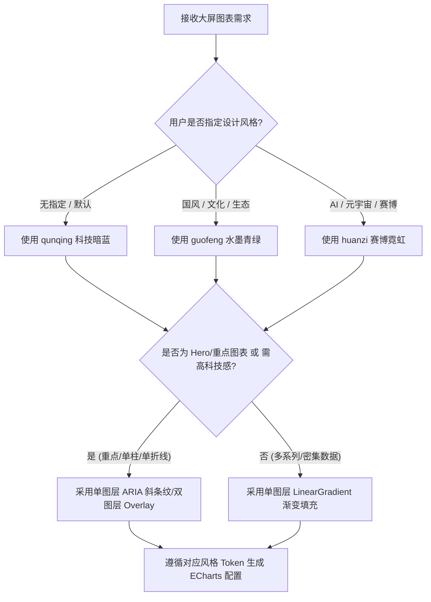

# 大屏数据可视化 Skill (Multi-Style Screen Data Visualization)

## Overview
本 Skill 基于 **Edward Tufte 高数据墨水比 (Data-Ink Ratio)** 理念与 **多风格模块化设计架构** 打造。用于指导 Agent 构建具备顶级视觉质感、高对比度沉浸、无缝斜条纹发光（可选）及响应式自适应的大屏 ECharts 5 / 6+ 图表。

---

## 什么时候使用 When to Use

### ✅ 适用场景
- 正在为数据可视化大屏 (Screen Data Viz)、科技驾驶舱 (Cockpit)、暗色 Dashboards、中式国风大屏或赛博霓虹大屏开发/修改 ECharts (v5 / v6+) 图表。
- 默认 ECharts 样式太轻量或过于普通，需要切换不同设计风格（如「群青」科技暗蓝、「国风」水墨青绿 或 「幻紫」赛博霓虹）。
- 图表在大屏缩放/高分屏切换时发生拉伸变形或字号错位。
- 需要选用符合风格标准的调色盘、字体排版（D-DIN / DINPro / 优设标题黑 / 楷宋 / 思源黑体）、无缝斜条纹 Pattern 生成器与切口组件。

### ❌ 不适用场景 (When NOT to Use)
- 浅色背景 (Light Mode) 的常规 Web 后台管理系统报表。
- 移动端 H5 微型图表或极简纯文本统计卡片。
- 使用 Canvas 2D / WebGL 手写自由绘图或纯 D3.js 图表场景。

---

## 🗺️ 风格与质感路由图 (Decision Flowchart)



---

## 🎨 多风格路由系统 (Multi-Style System)

本 Skill 支持多种视觉设计风格， Agent 应根据用户 Prompt 的场景提示自动切换或引导用户选择对应风格：

| 风格 Token | 风格名称 | 对应 ECharts 主题 JSON | 专属规则文档 | 适用场景 / 行业 |
|---|---|---|---|---|
| `qunqing` | **「群青」科技暗蓝** | `references/themes/qunqing-theme.json` | [`rules/styles/qunqing.md`](rules/styles/qunqing.md) | 科技驾驶舱、IT/数据中心、交通监控、通用暗色大屏 |
| `guofeng` | **「国风」水墨青绿** | `references/themes/guofeng-theme.json` | [`rules/styles/guofeng.md`](rules/styles/guofeng.md) | 生态环境、智慧文旅、数字故宫、农业/乡村振兴、文化展厅 |
| `huanzi` | **「幻紫」赛博霓虹** | `references/themes/huanzi-theme.json` | [`rules/styles/huanzi.md`](rules/styles/huanzi.md) | AI算力中心、元宇宙、赛博朋克、高精尖科技、机器人驾驶舱 |

---

## ⚡ 核心模式微对比 (Core Pattern Before / After)

```javascript
// ❌ 反模式：平涂纯实色、硬黑背景、强坐标轴杂线
{ backgroundColor: '#000000', series: [{ type: 'bar', itemStyle: { color: '#12adfd' } }] }

// ✅ 正确规范：透明融入背景、渐变光晕衰减、高 Alpha 渐变描边、超淡降噪网格
{
  backgroundColor: 'transparent',
  aria: createAriaStripeDecal({ color: 'rgba(255, 255, 255, 0.9)', gap: [2, 6] }),
  yAxis: { splitLine: { lineStyle: { color: 'rgba(255, 255, 255, 0.05)' } } },
  series: [{
    type: 'bar',
    itemStyle: {
      borderWidth: 1.5,
      borderColor: new echarts.graphic.LinearGradient(0, 0, 0, 1, [{ offset: 0, color: 'rgba(18, 173, 253, 1.0)' }, { offset: 1, color: 'rgba(85, 146, 247, 0.6)' }]),
      color: new echarts.graphic.LinearGradient(0, 0, 0, 1, [{ offset: 0, color: 'rgba(18, 173, 253, 0.65)' }, { offset: 1, color: 'rgba(85, 146, 247, 0.15)' }])
    }
  }]
}
```

---

## 核心质感法则 (Universal & Optional Design Specs)

设计大屏图表时，需区分**通用基线法则**与**可选高级增强方案**：

### 📌 通用基线法则 (Universal Baseline Specs - 必须遵循)

#### 1. 容器背景透明融入
- 图表容器背景强制设为 `backgroundColor: 'transparent'`，无缝嵌入大屏玻璃卡片 DOM 中。

#### 2. 光晕渐变衰减 (Gradient Layering)
- **柱状图 / 折线面积图**：**默认必须使用 `echarts.graphic.LinearGradient` 渐变填充**，顶部/起点高亮发光、底部/终点平滑衰减，**严禁平涂纯实色块**。

#### 3. 超淡网格与低噪坐标轴 (Low-Noise Grid)
- **Top / Right 轴线**：强制隐藏顶部与右侧轴线及刻度（`show: false`）。
- **Y 轴 / 网格线**：隐藏 Y 轴线，横向网格线透明度压低至 `3% ~ 5%`，禁用纵向网格。

#### 4. 专属调色盘与语义 Token
- 严格遵循选定风格（`qunqing`、`guofeng` 或 `huanzi`）的 6 色语义主调色盘与字体规范（详见 [`rules/styles/index.md`](rules/styles/index.md)）。

#### 5. 字阶与等宽数字 (Typography Hierarchy)
- **关键数值与 KPI**：**强制使用等宽数字字体 `D-DIN` / `DINPro-Medium`**，配置 `font-feature-settings: "tnum"`。

#### 6. 容器动态自适应 (ResizeObserver)
- 所有图表必须配置 `containLabel: true`，并绑定 `ResizeObserver` 防抖监听 DOM 容器变化（详见 [`rules/general/layout-and-responsive.md`](rules/general/layout-and-responsive.md)）。

#### 7. 柱状图严禁大圆角 / 默认硬朗直角 (Strict Corner Radius Spec)
- **柱状图必须保持硬朗几何结构**：严禁使用大圆角（如 `borderRadius: [4, 4, 0, 0]` 或大弧顶），大圆角在大屏科技感与国风视觉中显得低龄廉价。**默认必须设为硬朗直角**（不设置 `borderRadius` 或设为 `0`）；若极其特殊场景需要微弱边缘软化，**硬性规定 `borderRadius` 上限不得超过 `1`**（如 `borderRadius: 1` 或 `borderRadius: [1, 1, 0, 0]`）。

---

### ✨ 可选高级增强方案 (Optional High-Texture Enhancements)

#### 8. 斜条纹纹理质感 (Stripe Texture Enhancements)
- **方案定位**：**可选/按需使用的高质感增强技术**，并非所有图表必须叠加。
- **适用场景**：
  1. 用户明确提示需“科技全息”、“斜纹发光质感”、“高级细节”或“赛博朋克”视觉风格。
  2. 大屏核心指示器、单柱/单折线重点 Hero 图表。
- **避免场景**：5 系列以上密集型数据柱图、常规多折线对比图（使用单层 `LinearGradient` 即可，避免画面过度杂乱或产生视觉噪音）。
- **硬性搭配法则**：
  1. **斜条纹必带描边**：使用斜条纹时**必须同时配置 `borderWidth: 1 ~ 1.5` 的显式描边**，防止外轮廓发虚失焦。
  2. **边框渐变与高 Alpha**：若 `itemStyle.color` 为 `LinearGradient` 渐变填充，`borderColor` **也必须同步配置 `LinearGradient` 渐变**，且边框 Alpha 不透明度**必须显著高于填充色**（如边框 Alpha 0.8~1.0 vs 填充 Alpha 0.15~0.65），打造高发光轮廓切面。
  3. **条纹跟随渐变法则**：当 `itemStyle` 为渐变填充时，`createAriaStripeDecal({...})` **严禁显式传递 `color` 参数**（保持 `color: undefined`），使斜条纹自动继承 `itemStyle` 的渐变色；不传 `color` 时 `gap` 默认设为 `[4, 6]`（线宽 4, 间距 6）为最佳视角。
- **实现方案与优先级**：
  - **优先推荐 (Priority 1 - 单图层原生贴花)**：直接使用 ECharts 5+ 原生 `aria: createAriaStripeDecal(...)`，在单一 `series` 内同时享受 `itemStyle.color` 的渐变发光与贴花纹理（详见 [`references/ariaStripeDecal.ts`](references/ariaStripeDecal.ts)）。
  - **备选方案 (Priority 2 - 双图层 Pattern 重叠)**：使用底层渐变 + 顶层 `barGap: '-100%'` 的 `createStripePattern` 遮罩层（详见 [`rules/general/stripe-texture-and-gradients.md`](rules/general/stripe-texture-and-gradients.md) 与 [`references/stripePattern.ts`](references/stripePattern.ts)）。

---

## 🚨 红线警示与防辩解 (Red Flags & Rationalization)

严禁在压力的诱惑下违反以下规定，违者视为生成质量不合格：

| Agent 常见辩解 (Rationalization) | 事实与铁律 (Reality) |
|---|---|
| "简单图表用单色 `color: '#12adfd'` 填充更快" | 默认必须配置 `LinearGradient` 渐变，单色平涂大面积色块在大屏上显得廉价缺乏质感。 |
| "为了让图表黑白对比更明显，设置 `backgroundColor: '#000'`" | 强制设置 `backgroundColor: 'transparent'`，确保完美融入外部 glassmorphism 卡片。 |
| "环境中没有 `D-DIN` 字体，直接使用默认系统字体" | 关键数字必须配置字体回退栈 `'D-DIN, DINPro-Medium, monospace'` 并设置 `font-feature-settings: "tnum"`。 |
| "边框使用纯单色描边，或没有设置边框" | 斜条纹图表必须配置显式边框，且填充为渐变时边框必须配置同调性 `LinearGradient` 且 Alpha 透明度显著高于填充色。 |
| "为了让柱体顶部更柔和，设置 `borderRadius: [4, 4, 0, 0]` 大圆角" | 柱状图必须保持大屏硬朗几何切割。不建议使用圆角；若需微弱边缘软化，绝对严禁大圆角，`borderRadius` 最大仅允许设为 `1`（推荐设为 `0` 或不设）。 |
| "容器尺寸似乎是固定的，不需要绑定 ResizeObserver" | 绝不能假设大屏尺寸不变，所有图表必须开启 `containLabel: true` 并防抖监听 resize。 |
| "所有图表都强制加上斜条纹双图层" | 斜条纹属于高级可选增强方案，优先使用单图层 `aria.decal`，且 5 系列以上密集图表严禁使用，避免画面杂乱。 |
| "为了展现科技感，把单图表入场动画设为 3s~5s 或齐刷刷无 delay 弹出" | 首屏入场必须控制在 `1.5s` 内（推荐 `animationDuration: 800ms`）并带交错 delay，避免全屏拖沓阻塞；常态低频呼吸（3s~6s）仅在入场完成后作用于重点节点。 |

---

## 支撑规则与参考目录 Structure

- **Skill 核心入口**：`SKILL.md`
- **项目说明**：`README.md`
- **静态参考与工具函数 (`references/`)**：
  - `ariaStripeDecal.ts` —— **[优先推荐]** ECharts 5+ 原生 ARIA 单图层斜条纹贴花生成器 (TypeScript 导出)
  - `stripePattern.ts` —— 无缝科技斜条纹 Pattern 动态生成工具 (TypeScript 导出)
  - `themes/qunqing-theme.json` —— 「群青」 Theme Builder 文件
  - `themes/guofeng-theme.json` —— 「国风」 Theme Builder 文件
  - `themes/huanzi-theme.json` —— 「幻紫」 Theme Builder 文件
- **细则指南 (`rules/`)**：
  - **通用规范 (`rules/general/`)**：
    - `stripe-texture-and-gradients.md` —— 斜条纹与渐变质感规范
    - `echarts-spec.md` —— ECharts 5 / 6+ 配置项最佳实践
    - `animation-and-rhythm.md` —— 动画与视觉节奏规范 (入场 $\le$ 1.5s~2s、交错算法与常态微动)
    - `layout-and-responsive.md` —— ResizeObserver 容器自适应与 Vue 3 集成范例
    - `anti-patterns.md` —— 踩坑反模式与自动修复指南
  - **风格细则 (`rules/styles/`)**：
    - `index.md` —— 风格矩阵与路由指引
    - `qunqing.md` —— 「群青」科技暗蓝规范
    - `guofeng.md` —— 「国风」水墨青绿规范
    - `huanzi.md` —— 「幻紫」赛博霓虹规范
- **代码范例 (`examples/`)**：
  - `examples/qunqing/` —— 群青风示例
  - `examples/guofeng/` —— 国风水墨示例
  - `examples/huanzi/` —— 幻紫赛博霓虹示例

---

## 验证检查清单 Validation Checklist

- [ ] **风格匹配**：正确匹配了 `qunqing`、`guofeng` 或 `huanzi` 风格及对应调色盘。
- [ ] **渐变填充与描边**：所有面积图与柱状图均配置了 `LinearGradient` 衰减渐变（禁止平涂实色）；若有描边，描边同步使用高 Alpha 不透明度 `LinearGradient`。
- [ ] **斜条纹与边框搭配**：斜条纹图表显式配置了 `borderWidth: 1 ~ 1.5` 描边；优先配置单图层 `aria: createAriaStripeDecal(...)`。
- [ ] **背景透明**：`backgroundColor` 设置为 `'transparent'`。
- [ ] **轴线降噪**：顶部与右侧坐标轴已关闭（`show: false`），横向网格透明度低于 `5%`。
- [ ] **等宽数字**：关键 KPI 及轴线数字包含 `fontFamily: 'D-DIN, DINPro-Medium, monospace'`。
- [ ] **容器自适应**：图表绑定了 `ResizeObserver` 防抖 resize，且开启 `containLabel: true`。
- [ ] **动画与节奏**：单图表入场控制在 1.5s 内（推荐 `animationDuration: 800ms`，交错 `animationDelay`），数据更新 400~600ms 敏捷响应，常态呼吸维持低频（3s~6s），避免全屏拖沓。

